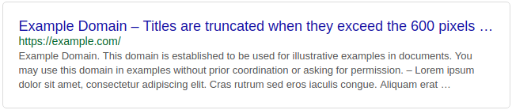

# React SERP Preview
Visualise how your website will appear in the Google search results.

[Live demo](https://mesoptier.github.io/react-serp-preview/)



- Same look as Google search results
- Titles are truncated at 600 pixels (by default)
- Description is truncated around 300 characters

## Installation

```shell
yarn add react-serp-preview
```

## Usage

```jsx harmony
import SerpPreview from 'react-serp-preview';

...

<SerpPreview 
    title="Example Domain"
    metaDescription={`Example Domain. This domain is established to be used for 
        illustrative examples in documents. You may use this domain in examples 
        without prior coordination or asking for permission.`}
    url="https://example.com/"
/>
```

| Prop              | Type     | Description                            |
|:----------------- |:-------- |:--------------------------------------- |
| `title`           | `string` | _(required)_ Website title             |
| `metaDescription` | `string` | _(required)_ Website description       |
| `url`             | `string` | _(required)_ Website URL               |
| `width`           | `number` | _(default: 600)_ Width of the preview  |
